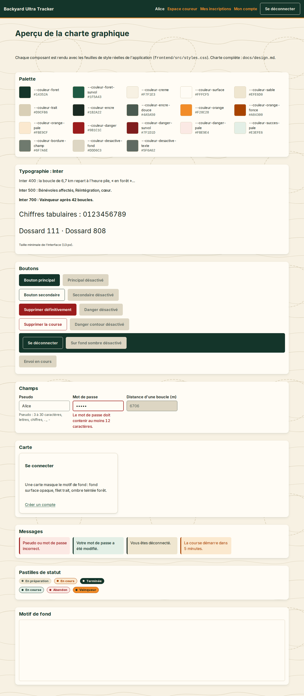

# Charte graphique

Charte de Backyard Ultra Tracker, posée par l'incrément R.1 (`docs/specs/increment-R.1.md`). Elle s'applique à tous les écrans existants et à venir. Source unique des valeurs : `frontend/src/styles/variables.css` ; styles partagés : `frontend/src/styles/base.css` et `frontend/src/styles/composants.css`, importés par `frontend/src/styles.css`.

## 1. Principes et décisions

Univers : une boucle de 6,7 km refaite toutes les heures, en forêt, de jour. Décisions de l'utilisateur :

1. **Thème clair sur fond crème** : `color-scheme: light`, pas de mode sombre ni de bascule jour/nuit.
2. **Inter, sans police display** : une seule police sans-serif sobre, Inter, auto-hébergée (SIL OFL 1.1), un seul style (droit), chiffres **tabulaires** pour les dossards, durées, distances et chronomètres.
3. **Courbes de niveau avec une boucle fermée** : motif de fond discret en SVG, la boucle en pointillés évoque le yard ; les sapins n'existent que dans le décor de la page d'accueil (`.decor-backyard`), jamais dans le motif du `body`.
4. **Univers forêt** : **vert forêt** profond, **orange** balise / frontale, **crème**.
5. Aucune dépendance lourde (ni bibliothèque de composants, ni Tailwind, ni Sass) et **aucune requête vers un CDN** : police et motif sont servis par le site.
6. Téléphone d'abord (360 px, 320 px), contrastes AA (WCAG 2.x), navigation clavier avec un contour de focus visible.

## 2. Palette

Le thème n'emploie aucune autre couleur (ni noir pur, ni blanc pur), à une exception près : le QR code d'une Inscription reste noir sur blanc pour la lecture par caméra. Cette exception est maintenue en contraste forcé (`forced-colors: active`) : le QR porte `forced-color-adjust: none`, car un QR recoloré ou inversé ne se scanne plus.

| Variable | Hex | Usage |
|---|---|---|
| `--couleur-foret` | `#14352A` | en-tête, bouton principal, titres, pastille `TERMINEE` |
| `--couleur-foret-survol` | `#1F5A43` | survol du bouton principal, liens |
| `--couleur-creme` | `#F7F1E3` | fond de page, texte sur forêt |
| `--couleur-surface` | `#FFFCF5` | cartes, champs, bouton secondaire |
| `--couleur-sable` | `#EFE6D0` | message d'information, survol secondaire, pastille `EN_PREPARATION` |
| `--couleur-trait` | `#D9CFB6` | filets, bordures de cartes, traits du motif (jamais de texte) |
| `--couleur-encre` | `#1B2A22` | texte courant |
| `--couleur-encre-douce` | `#4A5A50` | texte secondaire, aides |
| `--couleur-orange` | `#F28C28` | orange balise : accents et texte sur fond sombre uniquement, pastille `VAINQUEUR` |
| `--couleur-orange-fonce` | `#A84300` | texte et focus orange sur fond clair, pastille `EN_COURS` |
| `--couleur-orange-pale` | `#FBE9CF` | message d'avertissement, fond pastille `EN_COURS` |
| `--couleur-danger` | `#9B1C1C` | bouton danger, erreurs |
| `--couleur-danger-survol` | `#7F1D1D` | survol du bouton danger |
| `--couleur-danger-pale` | `#FBE9E4` | fond des erreurs, pastille `ABANDON` |
| `--couleur-succes-pale` | `#E3EFE6` | fond des succès, pastille `EN_COURSE` |
| `--couleur-bordure-champ` | `#6F7A6E` | bordure des champs |
| `--couleur-desactive-fond` | `#DDD6C3` | contrôle désactivé |
| `--couleur-desactive-texte` | `#5F6A62` | texte désactivé (exempt de contraste AA, WCAG 1.4.3) |

Alias sémantiques (valeurs `var()` des couleurs ci-dessus) :

| Alias | Valeur |
|---|---|
| `--couleur-fond-page` | `var(--couleur-creme)` |
| `--couleur-texte` | `var(--couleur-encre)` |
| `--couleur-lien` | `var(--couleur-foret-survol)` |
| `--couleur-focus` | `var(--couleur-orange-fonce)` |
| `--couleur-focus-sur-fonce` | `var(--couleur-orange)` |

## 3. Contrastes

Formule WCAG 2.x : chaque canal sRGB `c` (0 à 1) est linéarisé (`c / 12,92` si `c <= 0,04045`, sinon `((c + 0,055) / 1,055) ^ 2,4`), puis `L = 0,2126 R + 0,7152 G + 0,0722 B` et `ratio = (Lclaire + 0,05) / (Lsombre + 0,05)`. Seuils : texte normal 4,5 ; texte large (>= 24 px, ou >= 18,66 px en gras) et éléments non textuels (bordures de champ, focus, puces) 3. Ratios recalculés depuis les valeurs hexadécimales de la palette.

| Couple (texte / fond) | Ratio | Seuil | Conforme |
|---|---|---|---|
| encre / crème | 13,31 | 4,5 | oui |
| encre / surface | 14,63 | 4,5 | oui |
| encre-douce / crème | 6,50 | 4,5 | oui |
| encre-douce / surface | 7,14 | 4,5 | oui |
| encre-douce / sable | 5,89 | 4,5 | oui |
| encre-douce / trait (pire cas du motif) | 4,72 | 4,5 | oui |
| encre / sable | 12,06 | 4,5 | oui |
| crème / forêt (en-tête, pastille `TERMINEE`) | 11,86 | 4,5 | oui |
| surface / forêt (bouton principal) | 13,03 | 4,5 | oui |
| surface / forêt-survol (bouton survolé) | 7,88 | 4,5 | oui |
| forêt-survol / crème (liens) | 7,17 | 4,5 | oui |
| forêt-survol / surface (liens en carte) | 7,88 | 4,5 | oui |
| orange / forêt (liens de l'en-tête) | 5,44 | 4,5 | oui |
| encre / orange (pastille `VAINQUEUR`) | 6,11 | 4,5 | oui |
| orange-fonce / crème | 5,38 | 4,5 | oui |
| orange-fonce / surface | 5,91 | 4,5 | oui |
| orange-fonce / orange-pale (avertissement, pastille `EN_COURS`) | 5,09 | 4,5 | oui |
| surface / danger (bouton danger) | 7,95 | 4,5 | oui |
| surface / danger-survol | 9,78 | 4,5 | oui |
| danger / crème | 7,24 | 4,5 | oui |
| danger / danger-pale (erreurs, pastille `ABANDON`) | 6,94 | 4,5 | oui |
| forêt / succes-pale (succès, pastille `EN_COURSE`) | 11,29 | 4,5 | oui |
| encre / succes-pale (tuile de bénévole cochée) | 12,67 | 4,5 | oui |
| bordure-champ / surface (non textuel) | 4,37 | 3 | oui |
| bordure-champ / crème (non textuel) | 3,98 | 3 | oui |
| bordure-champ / sable (champ dans un encart, non textuel) | 3,61 | 3 | oui |
| orange / forêt (focus dans l'en-tête, non textuel) | 5,44 | 3 | oui |
| orange-fonce / crème (focus ailleurs, non textuel) | 5,38 | 3 | oui |
| orange-fonce / surface (focus ailleurs, non textuel) | 5,91 | 3 | oui |
| encre / trait (texte posé sur un trait du motif) | 9,67 | 4,5 | oui |
| forêt / trait (titre posé sur un trait du motif) | 8,62 | 4,5 | oui |
| forêt-survol / trait (lien posé sur un trait du motif) | 5,21 | 4,5 | oui |
| forêt / surface (titres, bouton secondaire, « Inscrit ») | 13,03 | 4,5 | oui |
| forêt / sable (bouton secondaire survolé) | 10,75 | 4,5 | oui |
| crème / forêt-survol (bouton sur fond sombre survolé) | 7,17 | 4,5 | oui |
| orange / forêt-survol (focus du bouton de l'en-tête survolé, non textuel) | 3,29 | 3 | oui |
| danger / surface (erreur de champ, bouton danger contour) | 7,95 | 4,5 | oui |
| encre / danger-pale (libellé dans une confirmation) | 12,76 | 4,5 | oui |
| orange-fonce / danger-pale (focus dans une confirmation, non textuel) | 5,16 | 3 | oui |

`--couleur-orange` n'est **jamais** employé en texte sur crème ou surface (ratio 2,18). La couleur ne porte jamais seule une information : chaque pastille et chaque message contient son libellé en texte, chaque champ invalide a un message d'erreur. Le texte d'un contrôle désactivé (desactive-texte / desactive-fond, 3,89) est exempté par WCAG 1.4.3.

## 4. Typographie

| Variable | Valeur |
|---|---|
| `--police-texte` | `'Inter', system-ui, -apple-system, 'Segoe UI', Roboto, sans-serif` |
| `--interligne-texte` | `1.5` |
| `--interligne-titre` | `1.2` |
| `--poids-normal` | `400` |
| `--poids-moyen` | `500` |
| `--poids-gras` | `700` |
| `--taille-petite` | `0.8125rem` (13 px, minimum de l'interface) |
| `--taille-secondaire` | `0.875rem` |
| `--taille-base` | `1rem` |
| `--taille-moyenne` | `1.125rem` |
| `--taille-grande` | `1.25rem` |
| `--taille-titre` | `1.75rem` |

- Famille : **Inter**, appliquée à `body`, héritée par `button`, `input`, `select`, `textarea` (`font: inherit`). Graisses 400, 500, 600 et 700 rendues par la même police variable. Un seul style (droit), pas de police display.
- **Chiffres tabulaires** : `font-variant-numeric: tabular-nums` sur `body` ; tous les chiffres ont la même largeur (dossards, durées, distances, futur chronomètre).
- Repli : `font-display: swap` affiche la pile de secours (`system-ui`…) le temps du chargement ; les caractères hors du sous-ensemble latin (autres alphabets) sont rendus par la police de secours.

**Licence et provenance**

- Licence : **SIL Open Font License 1.1** (OFL), texte complet dans `frontend/public/licences/Inter-OFL.txt`, servi à `/licences/Inter-OFL.txt`. Inter ne déclare aucun nom de police réservé : la version réduite garde le nom « Inter ».
- Version : **Inter 4.1** (table `name` : `Version 4.001;git-9221beed3`).
- Publication : https://github.com/rsms/inter/releases/tag/v4.1, archive `Inter-4.1.zip` (SHA-256 `9883fdd4a49d4fb66bd8177ba6625ef9a64aa45899767dde3d36aa425756b11e`), fichier source `InterVariable.ttf` (SHA-256 `4989b125924991b90d05b2d16e0e388c48f7d5bb8b30539bbf9c755278d0ccaf`).
- Fichier du dépôt : `frontend/src/styles/polices/inter-4.1-latin-variable.woff2`, 33 924 octets, **SHA-256 `95d2ef49922fd916ba055681c84d52622142930caf20ea6000a23a63967da70e`**.
- Réduction (une fois, fonttools 4.60.1 et brotli 1.1.0) : axe `opsz` figé à 14 (texte), axe `wght` restreint à 400-700, sous-ensemble latin, fonctionnalités par défaut plus `tnum`, `pnum`, `case`, format woff2 :

  ```sh
  fonttools varLib.instancer InterVariable.ttf opsz=14 wght=400:700 -o inter-instance.ttf
  pyftsubset inter-instance.ttf \
    --unicodes="U+0000-00FF,U+0131,U+0152-0153,U+02BB-02BC,U+02C6,U+02DA,U+02DC,U+0304,U+0308,U+0329,U+2000-206F,U+20AC,U+2122,U+2191,U+2193,U+2212,U+2215,U+FEFF,U+FFFD" \
    --layout-features+=tnum,pnum,case --flavor=woff2 \
    --output-file=inter-4.1-latin-variable.woff2
  ```

- Le build Angular empaquette le fichier avec une empreinte (`/media/inter-4.1-latin-variable-<EMPREINTE>.woff2`) ; Caddy le sert en `font/woff2` avec `Cache-Control: public, max-age=31536000, immutable`.

## 5. Espacements, rayons, ombres, cibles

| Variable | Valeur |
|---|---|
| `--espace-1` | `0.25rem` |
| `--espace-2` | `0.5rem` |
| `--espace-3` | `0.75rem` |
| `--espace-4` | `1rem` |
| `--espace-5` | `1.25rem` |
| `--espace-6` | `1.5rem` |
| `--espace-8` | `2rem` |
| `--espace-12` | `3rem` |
| `--rayon-s` | `0.375rem` |
| `--rayon-m` | `0.75rem` |
| `--rayon-pastille` | `999px` |
| `--ombre-carte` | `0 1px 2px rgb(20 53 42 / 0.10), 0 4px 12px rgb(20 53 42 / 0.08)` |
| `--cible-min` | `2.75rem` (44 px, cible tactile des boutons et champs) |
| `--largeur-carte` | `26rem` (416 px) |
| `--duree-transition` | `150ms` |

L'ombre est teintée forêt, jamais noire. Les cartes occupent toute la largeur moins `--espace-4` de marge de chaque côté sur téléphone.

## 6. Motif de fond

- Tuile SVG sans couture `viewBox="0 0 480 480"`, moins de 4 Ko, répétée (`background-repeat: repeat`) sur `body` au-dessus de `--couleur-creme`.
- Intégrée dans `frontend/src/styles/base.css` en **URI `data:`** (`url("data:image/svg+xml,…")`, caractères `#`, `<`, `>` et `%` encodés) : **aucune requête réseau** (ni `.svg`, ni `.png` : aucune confusion avec une image de QR code), couverte par la CSP existante (`img-src 'self' data:`). La source lisible ci-dessous fait référence : toute modification se fait ici puis est ré-encodée dans `base.css` (commentaires et retours à la ligne retirés, guillemets doubles remplacés par des simples).
- Contenu : 6 courbes de niveau (`fill="none"`, `stroke-width` 1 à 1,5 ; chaque courbe ressort du bord droit à l'ordonnée et avec la pente de son entrée à gauche) et **une boucle fermée** (chemin terminé par `Z`, trait 2, pointillés `stroke-dasharray`) entièrement dans la tuile : le yard.
- Une seule couleur de trait : `#D9CFB6` (`--couleur-trait`). Pire contraste d'un texte posé directement sur le motif : encre-douce / trait, 4,72.
- Ni script, ni texte, ni image, ni lien externe, ni police, ni sapin. Décoratif : aucun contenu, aucun rôle ARIA. Les cartes, opaques, le masquent.

Source du motif :

```svg
<svg xmlns="http://www.w3.org/2000/svg" viewBox="0 0 480 480" width="480" height="480" stroke="#D9CFB6" stroke-linecap="round" stroke-linejoin="round">
  <!-- Courbes de niveau : chacune ressort du bord droit à la même ordonnée et avec la même pente qu'à gauche (tuile sans couture). -->
  <path fill="none" stroke-width="1.25" d="M0 36C80 16 160 66 240 46S400 56 480 36"/>
  <path fill="none" stroke-width="1" d="M0 104C90 84 150 134 250 120S390 124 480 104"/>
  <path fill="none" stroke-width="1.5" d="M0 178C70 150 170 196 240 170S410 206 480 178"/>
  <path fill="none" stroke-width="1" d="M0 300C80 330 170 280 250 310S400 270 480 300"/>
  <path fill="none" stroke-width="1.25" d="M0 372C90 392 160 344 240 368S390 352 480 372"/>
  <path fill="none" stroke-width="1" d="M0 442C70 426 170 466 250 446S410 458 480 442"/>
  <!-- Boucle fermée en pointillés : le yard, refait à chaque heure. -->
  <path fill="none" stroke-width="2" stroke-dasharray="7 6" d="M150 236C148 186 196 152 262 156C326 160 352 204 344 256C336 312 284 338 228 330C176 322 152 290 150 236Z"/>
</svg>
```

### Décor de la page d'accueil

Décor « backyard » de l'accueil (R.4), plus illustratif que le motif du `body`, qu'il recouvre.

- **Classe partagée** `.decor-backyard`, définie dans `frontend/src/styles/decor.css` (importé par `frontend/src/styles.css` après `composants.css`) : les tuiles pèsent plusieurs ko et ne tiennent pas dans le budget `anyComponentStyle` (4 kB) d'un composant ; la classe a été réutilisée par la connexion et la création de compte (R.5). Appliquée au `main` de l'accueil, de la connexion et de la création de compte.
- **Fond opaque** `--couleur-creme` et **deux couches** `background-image` en URI `data:image/svg+xml` (mêmes règles d'encodage que le motif du `body`), de haut en bas :
  1. **Sapins** : tuile `viewBox="0 0 480 160"` sans couture horizontale (aucune forme ne touche les bords gauche et droit), `repeat-x`, collée au bas de l'élément (`background-position: left bottom`), hauteur affichée de **6rem** (propriété locale `--decor-hauteur-sapins`, en `rem` : la bande suit l'agrandissement du texte). Six silhouettes de quatre tailles, en aplats `#1F5A43` (`--couleur-foret-survol`) et `#14352A` (`--couleur-foret`).
  2. **Courbes de niveau et boucle** : tuile `viewBox="0 0 640 480"` sans couture, `repeat`, traits `#D9CFB6` (`--couleur-trait`) uniquement, `fill="none"` : 6 courbes ouvertes (traits 1,5 à 2,5) et **exactement une boucle fermée** (chemin terminé par `Z`, trait 2,5, `stroke-dasharray`) entièrement dans la tuile.
- Chaque tuile pèse **au plus 4 096 octets** décodée ; ni script, ni texte, ni `image`, ni `use`, ni `foreignObject`, ni `href`, ni lien externe, ni police ; toutes ses couleurs appartiennent à la palette (hexadécimaux en dur, exception admise des URI `data:` qui ne peuvent pas utiliser `var()`).
- **Lisibilité** : l'élément décoré réserve la bande de sapins par un `padding-bottom` d'au moins `var(--decor-hauteur-sapins) + var(--espace-4)` ; le texte ne se pose que sur le crème ou un trait (pires cas : forêt / trait 8,62, encre / trait 9,67).
- Décoratif : aucun contenu, aucun rôle ARIA, aucune animation. En **contraste forcé** (`forced-colors: active`), `background-image: none`.
- Les sources lisibles ci-dessous font référence : toute modification se fait ici puis est ré-encodée dans `decor.css` (commentaires et retours à la ligne retirés, guillemets doubles remplacés par des simples, `#`, `<`, `>` et `%` encodés).

Source de la couche sapins :

```svg
<svg xmlns="http://www.w3.org/2000/svg" viewBox="0 0 480 160" width="480" height="160">
  <!-- Six sapins à trois étages, quatre tailles, deux verts ; aucun ne touche les bords gauche et droit (tuile sans couture en X), tous posés sur y = 160. -->
  <path fill="#14352A" d="M60 10L88.6 64 74.6 64 101.6 112 83.4 112 112 160 8 160 36.6 112 18.4 112 45.4 64 31.4 64Z"/>
  <path fill="#1F5A43" d="M150 60L169.8 96 160.1 96 178.8 128 166.2 128 186 160 114 160 133.8 128 121.2 128 139.9 96 130.2 96Z"/>
  <path fill="#14352A" d="M230 34L254.2 79.4 242.3 79.4 265.2 119.7 249.8 119.7 274 160 186 160 210.2 119.7 194.8 119.7 217.7 79.4 205.8 79.4Z"/>
  <path fill="#1F5A43" d="M310 70L327.6 102.4 319 102.4 335.6 131.2 324.4 131.2 342 160 278 160 295.6 131.2 284.4 131.2 301 102.4 292.4 102.4Z"/>
  <path fill="#1F5A43" d="M398 16L425.5 67.8 412 67.8 438 113.9 420.5 113.9 448 160 348 160 375.5 113.9 358 113.9 384 67.8 370.5 67.8Z"/>
  <path fill="#14352A" d="M460 100L468.8 121.6 464.5 121.6 472.8 140.8 467.2 140.8 476 160 444 160 452.8 140.8 447.2 140.8 455.5 121.6 451.2 121.6Z"/>
</svg>
```

Source de la couche courbes de niveau et boucle :

```svg
<svg xmlns="http://www.w3.org/2000/svg" viewBox="0 0 640 480" width="640" height="480" stroke="#D9CFB6" stroke-linecap="round" stroke-linejoin="round">
  <!-- Courbes de niveau : chacune ressort du bord droit à la même ordonnée et avec la même pente qu'à gauche (tuile sans couture). -->
  <path fill="none" stroke-width="2" d="M0 40C100 14 210 74 320 50S540 66 640 40"/>
  <path fill="none" stroke-width="1.5" d="M0 118C90 92 200 150 330 128S550 144 640 118"/>
  <path fill="none" stroke-width="2" d="M0 214C110 184 220 240 330 206S530 244 640 214"/>
  <path fill="none" stroke-width="1.5" d="M0 330C100 362 210 300 320 334S540 298 640 330"/>
  <path fill="none" stroke-width="2.5" d="M0 410C90 432 220 380 330 404S550 388 640 410"/>
  <path fill="none" stroke-width="1.5" d="M0 456C120 442 220 470 340 458S520 470 640 456"/>
  <!-- Boucle fermée en pointillés, plus grande et plus épaisse que celle du motif du body : le yard. -->
  <path fill="none" stroke-width="2.5" stroke-dasharray="10 8" d="M200 250C196 186 262 146 340 150C420 154 466 206 458 266C450 330 388 352 318 346C250 340 204 312 200 250Z"/>
</svg>
```

### Visuel de substitution des Courses

Visuel d'une Course sans logo (R.7), en tête de sa carte (section 7, « Carte de course ») et, réduit, dans l'état vide de la liste.

- **Classe partagée** `.visuel-substitution`, définie dans `frontend/src/styles/pictogrammes.css` (importé par `styles.css` après `decor.css`) : fond `--couleur-sable`, bordure 1px `--couleur-trait`, une couche `background-image` en URI `data:image/svg+xml` (mêmes règles d'encodage que le motif du `body`), `background-size: cover`, centrée, sans répétition. La zone (`aspect-ratio: 16 / 9`, `border-radius: var(--rayon-s)`) est fixée par le composant qui l'utilise.
- Tuile `viewBox="0 0 320 180"` (16 / 9), **au plus 2 048 octets** décodée : 4 courbes de niveau ouvertes (trait 1,5) et **une boucle fermée en pointillés** (chemin terminé par `Z`, trait 2,5, `stroke-dasharray`), traits `#D9CFB6` (`--couleur-trait`) uniquement, `fill="none"`. Ni script, ni texte, ni image, ni lien externe.
- Sur une carte de course, l'élément `course-logo-absent` contient le texte « Aucun logo » **masqué visuellement** (`position: absolute`, 1 x 1 px, `clip-path: inset(50%)`, `overflow: hidden`, `white-space: nowrap`, parent `position: relative`, couleur `--couleur-encre-douce` : 5,89 sur sable) : lu par les lecteurs d'écran, jamais affiché. Le visuel lui-même est décoratif.
- En **contraste forcé** (`forced-colors: active`), `background-image: none` : il reste un cadre bordé.

Source du visuel de substitution :

```svg
<svg xmlns="http://www.w3.org/2000/svg" viewBox="0 0 320 180" width="320" height="180" fill="none" stroke="#D9CFB6" stroke-linecap="round" stroke-linejoin="round">
  <!-- Courbes de niveau. -->
  <path stroke-width="1.5" d="M0 22C60 6 120 40 180 28S280 34 320 20"/>
  <path stroke-width="1.5" d="M0 58C70 40 130 76 200 62S290 66 320 54"/>
  <path stroke-width="1.5" d="M0 136C70 154 140 118 210 140S290 122 320 134"/>
  <path stroke-width="1.5" d="M0 166C80 154 150 178 220 166S290 172 320 162"/>
  <!-- Boucle fermée en pointillés : le yard. -->
  <path stroke-width="2.5" stroke-dasharray="8 6" d="M108 96C106 68 136 52 168 54C202 56 222 76 218 102C214 128 188 140 160 138C130 136 110 122 108 96Z"/>
</svg>
```

## 7. Composants

**Base** (`base.css`)
- `body` : marge 0, `--police-texte`, `--taille-base`, `--interligne-texte`, `tabular-nums`, texte `--couleur-texte`, fond `--couleur-fond-page` et motif.
- `h1` à `h3` : `--couleur-foret`, graisse 700, interligne `--interligne-titre`.
- Liens (`a`) : `--couleur-lien`, soulignés (`text-underline-offset: 0.2em`).
- Focus : `:focus-visible` = `outline: 3px solid var(--couleur-focus); outline-offset: 2px` ; dans `.entete`, la couleur devient `--couleur-focus-sur-fonce`. Aucun `outline: none`.
- `::selection` : fond sable. `prefers-reduced-motion: reduce` : aucune transition ni animation. Transitions limitées à `--duree-transition`.
- Décor backyard (`decor.css`) : `.decor-backyard`, fond crème opaque, bande de sapins de 6rem en bas et courbes de niveau avec boucle (section 6, « Décor de la page d'accueil ») ; masqué en contraste forcé.

**Boutons** (`composants.css`) : `min-height: var(--cible-min)`, `padding: var(--espace-3) var(--espace-5)`, graisse 600, `border-radius: var(--rayon-s)`, bordure 1px.

| Classe | Alias historique | Normal | Survol |
|---|---|---|---|
| `.bouton` (principal) | - | fond forêt, texte surface | fond forêt-survol |
| `.bouton--secondaire` | `.ligne__action` | fond surface, bordure et texte forêt | fond sable |
| `.bouton--danger` (action destructive confirmée) | `.ligne__action--danger-plein` | fond danger, texte surface | fond danger-survol |
| `.bouton--danger-contour` (ouvre la confirmation) | `.ligne__action--danger` | fond surface, bordure et texte danger | fond danger-pale |
| `.bouton--sur-fonce` (sur fond sombre) | - | fond transparent, bordure et texte crème | fond forêt-survol |

Désactivé (`:disabled`, envoi en cours) : fond `--couleur-desactive-fond`, texte `--couleur-desactive-texte`, curseur `wait`.

**Champs** : `input`, `select`, `textarea` en fond surface, texte encre, bordure 1px `--couleur-bordure-champ`, `border-radius: var(--rayon-s)`, hauteur minimale `--cible-min`, `padding: var(--espace-2) var(--espace-3)`, pleine largeur dans `.champ` ; `[aria-invalid='true']` : bordure 2px `--couleur-danger` ; désactivé : couleurs de désactivation. `label` : graisse 600, encre. `.aide` : encre-douce, `--taille-secondaire`. `.erreur` (erreur de champ) : danger, graisse 500.

**Carte** : `.carte` en fond surface, bordure 1px `--couleur-trait`, `border-radius: var(--rayon-m)`, `box-shadow: var(--ombre-carte)`, `padding: var(--espace-6)`, `max-width: var(--largeur-carte)` (variantes locales plus larges conservées), `box-sizing: border-box`.

**Carte sur décor** (connexion et création de compte, R.5) : la carte, opaque, est le seul contenu du `main` décoré (`main.page.decor-backyard`) ; aucun texte n'est posé sur le décor. Le `main` réserve la bande de sapins par un `padding-bottom` d'au moins `var(--decor-hauteur-sapins) + var(--espace-4)` et la carte reste centrée dans l'espace au-dessus. La carte porte `overflow-wrap: anywhere` : un mot plus large que la carte (titre, pseudo de 30 caractères) est coupé au lieu de déborder. Règles dans `comptes/formulaire-compte.css` (sélecteurs `.page.decor-backyard` et `.page.decor-backyard .carte`), `page-carte.css` reste inchangé.

**Messages** : `padding: var(--espace-3)`, `border-radius: var(--rayon-s)`, bordure gauche 4px de la couleur du texte.

| Classe | Fond | Texte | Alias historiques |
|---|---|---|---|
| `.message--erreur` | danger-pale | danger | `.erreur--generale`, `.entete__erreur`, `.logo__erreur`, `.suppression__erreur`, erreur du QR code |
| `.message--succes` | succes-pale | forêt | `.succes`, `.message-succes` |
| `.message--info` | sable | encre | `.message-info` |
| `.message--avertissement` | orange-pale | orange-fonce | - |

**En-tête** : fond forêt, texte crème, filet inférieur 3px orange ; titre crème sans soulignement à gauche, menu burger à droite ; message d'erreur de déconnexion (`.entete__erreur`) sur sa propre ligne.

**Menu burger de l'en-tête** (composant unique `app-menu-burger`, `frontend/src/app/entete/menu-burger/`, pour le visiteur non connecté comme pour l'utilisateur connecté ; rien pendant que l'état de session est inconnu) : affiché à droite du titre, sur la même ligne à toutes les largeurs (l'en-tête porte alors `.entete--menu` : le titre, borné, se coupe si besoin). Visiteur et connecté ne diffèrent que par les données : nom du panneau, pseudo éventuel et liste d'entrées, produite par rôle à un seul endroit (`entete/entrees-menu.ts`). Chaque état de session a sa propre instance : un changement d'état recrée le menu, fermé.
- `.menu-burger__bouton` : au moins `--cible-min` x `--cible-min` (44 px), fond transparent, bordure 1px et icône `--couleur-creme`, `border-radius: var(--rayon-s)`, fond `--couleur-foret-survol` au survol et menu ouvert, sans texte visible (nom accessible `aria-label` « Menu du compte »). Icône « tête » : `svg` inline 24 x 24 px en traits (`stroke="currentColor"`, épaisseur 2, extrémités arrondies), `aria-hidden="true"`, seule exception admise à la règle « pas de `svg` dans le DOM » (section 10), sans fichier ni police d'icônes.
- `.menu-burger__panneau` (`nav`, « Menu visiteur » ou « Menu utilisateur », attribut `hidden` quand il est fermé) : en absolu sous le bouton (`--espace-2`), bord droit sur celui de l'en-tête, fond `--couleur-foret`, `box-shadow: var(--ombre-carte)`, `border-radius: var(--rayon-m)`, largeur minimale 14rem bornée au viewport (`calc(100vw - 2 * var(--espace-4))`), hauteur bornée (`calc(100vh - 100%)`) avec défilement vertical interne, padding vertical `--espace-2`.
- `.menu-burger__pseudo` (connecté) : avant la liste, texte simple ni lien ni bouton ni focusable, précédé d'un « Connecté en tant que » masqué visuellement (lu par les lecteurs d'écran) ; graisse 700, crème, `padding: var(--espace-3) var(--espace-4)`, filet bas 1px `--couleur-foret-survol` ; un pseudo long passe à la ligne (`overflow-wrap: anywhere`), jamais tronqué.
- `.menu-burger__entree` : lien ou commande, ligne entière cliquable, hauteur `--cible-min`, `padding: var(--espace-3) var(--espace-4)`, texte crème graisse 600 non souligné (crème / forêt 11,86) ; survol et focus clavier : fond forêt-survol et soulignement (crème / forêt-survol 7,17) ; page courante (chemin exact, `aria-current="page"`, `.menu-burger__entree--courante`) : graisse 700 et filet gauche 4px `--couleur-orange` (jamais d'orange en texte). « Se déconnecter » (`bouton-deconnexion`) est une ligne d'entrée comme les liens (bouton sans bordure, fond transparent, aligné à gauche), désactivée pendant l'envoi. Contour de focus de l'en-tête (orange, 5,44 sur forêt, 3,29 sur forêt-survol). Aucune transition ni animation.
- Entrées par rôle, dans l'ordre : visiteur « Se connecter », « Créer un compte » ; coureur « Espace coureur », « Mes inscriptions » ; admin et admin master « Administration » ; bénévole « Espace bénévole » ; puis, pour tout compte connecté, « Mon compte » et « Se déconnecter ».
- Pattern **disclosure navigation** (WAI-ARIA Authoring Practices), pas `menu` / `menuitem` : les entrées sont surtout des liens de navigation (une commande « Se déconnecter » y est admise) ; le pattern `menu` imposerait flèches, type-ahead et focus itinérant, et ferait passer les lecteurs d'écran en mode application là où le Tab est attendu. **Pas de flèches** ni Début / Fin : au plus 4 entrées interactives, Tab et Maj+Tab suffisent. Le bouton porte `aria-expanded` et `aria-controls`, sans `aria-haspopup`. Fermeture par Échap (focus rendu au bouton), appui extérieur, sortie du focus, sélection d'une entrée (focus rendu au bouton pour une commande) ou changement de route ; aucun piège de focus ; à l'ouverture, le focus va sur la première entrée (jamais sur le pseudo).

**Section repliable** (disclosure, R.6, écran Mon compte : `comptes/mon-compte/mon-compte.css`) : le titre `h2` de la section contient un `<button type="button">` dont le libellé est le titre ; le bouton porte `aria-expanded` (`true` / `false`, toujours présent) et `aria-controls` vers le panneau. Le panneau reste **toujours dans le DOM** (pas de `@if`) et est masqué par `display: none` quand la section est repliée (attribut `hidden` + règle `[hidden] { display: none }`, voir section 10) ; un message de résultat (succès) se place dans la section, hors du panneau, pour rester visible panneau replié. Le focus reste sur le bouton au dépliage et au repli ; s'il était dans le panneau quand celui-ci se replie (envoi réussi), il est rendu au bouton. Le bouton est `bouton bouton--secondaire` pleine largeur, texte à gauche, `font-size: var(--taille-base)`, désactivé pendant un envoi ; l'état est indiqué par un chevron `::after` (carré de 0,5rem, bordures droite et basse 2px `currentColor`, `rotate(45deg)` replié, `rotate(-135deg)` déplié, `flex: none`), sans transition. Pas de fermeture par Échap. Replier vide les champs et les messages du panneau.

**Carte de course** (R.7, écran Gestion des courses : `administration/courses/liste-courses/liste-courses.css`, `logo-course/logo-course.css`, `gestion-courses/gestion-courses.css` ; indicateurs et état vide : règles partagées de `styles/cartes.css` depuis R.9a)
- **Grille** `ul.liste` : `display: grid`, `grid-template-columns: repeat(auto-fill, minmax(min(100%, 17rem), 1fr))`, `gap: var(--espace-4)`, sans filet ; ordre de l'API, de gauche à droite puis ligne par ligne (ordre du DOM = ordre de Tab, aucun `order`). La carte de l'écran est élargie à `max-width: 64rem` (3 colonnes de 314 px à 1 280 px, 2 à 768 px, 1 sur téléphone) et le formulaire de déclaration / modification (`.formulaire--saisie`) borné à `40rem`.
- **Carte** `li.course-carte` (jamais `.carte`, réservée à la carte de la page) : `box-sizing: border-box`, fond surface, bordure 1px `--couleur-trait`, `border-radius: var(--rayon-m)`, `box-shadow: var(--ombre-carte)`, `padding: var(--espace-4)`, colonne flex à `gap: var(--espace-4)`, `min-width: 0`, `overflow-wrap: anywhere`, aucun `overflow: hidden` (contour de focus entier). Contenu, dans l'ordre : visuel puis actions de logo, en-tête, indicateurs, actions, suppression.
- **Visuel** : zone `aspect-ratio: 16 / 9`, pleine largeur, `border-radius: var(--rayon-s)`, fond sable ; logo en `object-fit: contain` (ni déformé ni recadré) ou visuel de substitution (section 6). Actions de logo (`ligne__action`) **sous** le visuel, jamais en surimpression ; l'aperçu d'un nouveau logo garde sa vignette de 64 x 64 px dans son panneau sable.
- **En-tête** : ligne date + pastille (flex, retour à la ligne, `gap` 8 px 12 px), date `--taille-grande`, graisse 700, forêt ; pastille de statut (section 8) ; nom en `h3` `--taille-moyenne`, forêt, jamais tronqué.
- **Indicateurs** : `dl.indicateurs` (`repeat(auto-fit, minmax(min(100%, 6.5rem), 1fr))`, `gap` 12 px 16 px) de `div.indicateur.indicateur--<suffixe>` ; pictogramme `::before` 1.5rem (24 px) sur deux lignes, à gauche du libellé `dt` (`--taille-secondaire`, encre-douce, toujours présent : le pictogramme ne porte jamais seul le sens) et de la valeur `dd` (graisse 600, encre). **Indicateurs partagés** (R.9a) : ces règles sont dans `styles/cartes.css` (`.indicateurs`, `.indicateurs > .indicateur`, `.indicateurs dt`, `.indicateurs dd` ; le sélecteur enfant laisse intact `p.indicateur` de l'Espace coureur), réutilisées par la fiche de Course. Pictogramme = `mask-image` (et `-webkit-mask-image`) en URI `data:image/svg+xml` teinté par `background-color: var(--couleur-foret)` (13,03 sur surface) ; en contraste forcé, `forced-color-adjust: none` et `background-color: CanvasText`. Règles dans `pictogrammes.css`.
- **Actions** : flex, retour à la ligne, `gap` 12 px, `margin-top: auto` (alignées au bas des cartes d'une rangée) : « Fiche » (lien) et « Modifier » en `ligne__action` secondaires ; la suppression (`ligne__action--danger`) suit.
- **Écran étroit et texte agrandi** : `main.page` de l'écran est un conteneur de requête (`container: page-gestion-courses / inline-size`) ; sous `15rem` de large (320 ou 360 px avec le texte à 200 %, jamais au texte normal), la carte de la page passe à `padding: var(--espace-3)`, la carte de course à `var(--espace-2)`, le panneau d'aperçu du logo à `var(--espace-2)` et les boutons de la carte et du logo à `padding-inline: var(--espace-3)` : la confirmation de suppression et l'aperçu tiennent dans la carte.
- **État vide** `div.etat-vide` : centré, `padding: var(--espace-6)`, bordure 1px **pointillée** `--couleur-trait`, `border-radius: var(--rayon-m)`, fond sable ; visuel de substitution réduit (16 / 9, largeur bornée à 12rem), message (graisse 600, encre) puis `.aide`. Règle unique `.etat-vide`, `.etat-vide__visuel`, `.etat-vide__message` de `styles/cartes.css` (aucune copie locale).

**Carte de liste** (R.8a, feuille globale `styles/cartes.css`, partagée par les écrans en cartes : Espace coureur, Mes inscriptions, puis R.8b)
- **Grille** `ul.grille-cartes` : `display: grid`, `grid-template-columns: repeat(auto-fill, minmax(min(100%, var(--grille-min, 17rem)), 1fr))`, `align-items: stretch`, `gap: var(--espace-4)`, sans puce ni marge ; un écran ajuste la largeur minimale d'une colonne par `--grille-min`. Ordre de l'API (ordre du DOM = ordre de Tab, aucun `order`).
- **Carte** `li.carte-liste` (jamais `.carte`) : mêmes règles que la carte de course de R.7 (fond surface, bordure 1px trait, `--rayon-m`, `--ombre-carte`, `padding: var(--espace-4)`, colonne flex à `gap: var(--espace-4)`, `min-width: 0` sur la carte et ses enfants, `overflow-wrap: anywhere`, aucun `overflow: hidden`).
- **Visuel** `.carte-liste__visuel` : zone 16 / 9 pleine largeur, `--rayon-s`, fond sable ; enfant (`img` en `object-fit: contain` ou `div.visuel-substitution` décoratif, `aria-hidden`) en pleine zone.
- `.carte-liste__action-pleine` (sur l'hôte d'un composant d'action) : son bouton direct `.ligne__action` occupe la largeur utile de la carte.
- **État vide** `div.etat-vide` (bloc sable en pointillés, visuel réduit `.etat-vide__visuel.visuel-substitution`, message `.etat-vide__message`), même forme que R.7.
- **Repli étroit** : le `main.page` de l'écran est le conteneur `cartes` (`container: cartes / inline-size`) ; sous `15rem` (320 ou 360 px avec le texte à 200 %), la carte de la page passe à `padding: var(--espace-3)` (règle de l'écran), la carte de liste à `var(--espace-2)` et ses boutons (ainsi que celui de l'état vide) à `padding-inline: var(--espace-3)`. La carte de la page de ces écrans est élargie à `64rem` et porte `overflow-wrap: anywhere` (titre `h1` coupé à 200 %).
- **Variante de page `.page--cartes`** (R.8b) : `main.page.page--cartes` est le conteneur `cartes` ; sa carte `> .carte` prend `max-width: var(--carte-largeur, 64rem)` et `overflow-wrap: anywhere`, et passe à `padding: var(--espace-3)` dans le repli étroit. Un écran ajuste la largeur par `--carte-largeur` sur `.page` (Comptes : `40rem`). Utilisée par l'Espace bénévole, la gestion des Comptes et l'accueil Administration ; l'Espace coureur et Mes inscriptions gardent leurs règles propres (dédoublonnage en R.9).
- **Titre, texte et pied partagés** (cartes sans feuille propre) : `.carte-liste__titre` (`h2`, `margin: 0`, `--taille-moyenne`, graisse 700, forêt, `overflow-wrap: anywhere`), `.carte-liste__texte` (`margin: 0`, encre), `.carte-liste__pied` (`margin-top: auto`, aligné au bas des cartes d'une rangée).

**Carte de Course du bénévole** (R.8b, Espace bénévole : `scan/accueil-benevole/accueil-benevole.css`)
- `li.carte-liste` (`--grille-min` 17rem par défaut) **sans action** (ni lien, ni bouton, ni focus, ni `cursor: pointer`) : visuel (logo ou visuel de substitution), date (`--taille-grande`, graisse 700, forêt), nom en `h2.carte-liste__titre`, pastille de statut de la Course en `.carte-liste__pied` (`align-self: flex-start`). État vide : `.etat-vide` avec l'aide « Les courses auxquelles un administrateur vous affecte apparaîtront ici. ».

**Carte de Compte** (R.8b, gestion des administrateurs et des bénévoles : `administration/gestion-comptes/gestion-comptes.css`)
- Page à `--carte-largeur: 40rem`, grille à `--grille-min: 13rem` (2 colonnes dès 514 px de fenêtre) ; `li.carte-liste` resserrée (`gap: var(--espace-1)`, `padding: var(--espace-3)`) : pseudo (`.ligne__pseudo`, bloc, `--taille-moyenne`, graisse 700, forêt, coupé) puis « Créé le jj/mm/aaaa à HH:mm » (`.ligne__date`, `--taille-secondaire`, encre-douce). Aucun titre par carte. État vide : `.etat-vide` avec l'aide « Créez-en un avec le formulaire ci-dessous. ».

**Encart de formulaire** (R.8b, composant partagé depuis R.9a : `styles/cartes.css`)
- `form.formulaire.encart` : bordure 1px trait, `--rayon-m`, `padding: var(--espace-4)`, fond sable (encre / sable 12,06, encre-douce / sable 5,89, danger / sable 6,56 pour `.erreur`, bordure-champ / sable 3,61) ; champs, messages et bouton principal inchangés, message de succès et erreur générale en tête ; les liens de retour restent hors de l'encart. Utilisé par les formulaires de création de Compte et le formulaire de déclaration / modification de Course (`max-width: 40rem`, `padding: var(--espace-3)` sous `15rem` de conteneur `page-gestion-courses`).
- Variante `.encart--edition` (formulaire de Course en modification) : bordure forêt et `box-shadow: 0 0 0 1px var(--couleur-foret)` (trait apparent de 2px, sans décalage de mise en page). Le titre « Modifier la course » porte l'information, la bordure la renforce ; « Annuler » retire la classe.

**Fiche de Course** (R.9a, `administration/courses/fiche/fiche-course.css`, `inscrits-course/inscrits-course.css`)
- Page `main.page.page--cartes`, `--carte-largeur: 44rem` (704 px). Dans la carte, dans l'ordre : en-tête, repères, indicateurs, section Bénévoles, section Inscrits, lien de retour. Les deux sections sont séparées par un filet haut 1px trait et `padding-top: var(--espace-4)`. États introuvable, erreur et chargement : titre, message et lien de retour seulement.
- **En-tête** `header.fiche-entete` (flex, retour à la ligne, `gap: var(--espace-4)`) : `div.fiche-visuel` (`width: min(100%, 12rem)`, 16 / 9, `--rayon-s`, fond sable) contenant le logo (`object-fit: contain`) ou un `div.visuel-substitution` décoratif (`aria-hidden`), puis le nom en `h1` (`flex: 1 1 12rem`, coupé, jamais tronqué).
- **Repères** `dl.fiche-reperes` (flex, retour à la ligne, `gap` 8 px 24 px) : date (`time`, `--taille-grande`, graisse 700, forêt) puis pastille de statut de la Course (section 8) ; libellés `dt` comme ceux des indicateurs.
- **Indicateurs** : `dl.indicateurs` partagés (voir « Carte de course ») : 5 colonnes de 118 px dans la carte de 704 px, 2 colonnes à 320 et 360 px.
- **Tuiles de bénévoles** `fieldset.benevoles` (légende `.masque`, sans bordure, `min-width: 0`) en grille `repeat(auto-fill, minmax(min(100%, 13rem), 1fr))`, `gap: var(--espace-3)` (3 colonnes de 210 px dans la carte de 704 px, 1 sur téléphone). Tuile `div.benevole` : flex, `min-height: var(--cible-min)`, `padding-inline: var(--espace-3)`, bordure 1px trait, `--rayon-s`, fond surface, aucun `overflow` ; case de 1.25rem puis libellé étiré sur toute la hauteur (cible de 44 px, graisse 400, coupé). Cochée (`:has(input:checked)`) : bordure forêt, fond succes-pale (forêt 11,29, encre 12,67) ; la case native porte l'état.
- **Aucun bénévole** : `.etat-vide` (visuel réduit, message, lien `a.bouton.bouton--secondaire` « Gérer les bénévoles »).
- **Inscrits** : résumé `p.resume` (fond sable, `padding: var(--espace-3)`, `--rayon-s`, compteur graisse 600), tableau (`th`, `td` coupés ; dossard `--taille-moyenne`, graisse 700, forêt ; statut d'Inscription en texte brut, sans pastille) ; aucun inscrit : `.etat-vide` (visuel `span`, jamais `img` ni `svg`).

**Carte de navigation** (R.8b, accueil Administration, sans feuille de composant)
- `ul.grille-cartes.grille-cartes--navigation` (`--grille-min: 15rem`) de `li.carte-liste` : `h2.carte-liste__titre`, `p.carte-liste__texte` descriptif, puis `a.bouton.carte-liste__pied` (bouton principal pleine largeur, aligné au bas de la rangée), seul arrêt de Tab de la carte.

**Carte de Course ouverte** (R.8a, Espace coureur : `inscriptions/accueil-coureur/accueil-coureur.css`)
- `li.carte-liste`, dans l'ordre : visuel (logo ou visuel de substitution), date (`--taille-grande`, graisse 700, forêt) puis nom en `h2` (`--taille-moyenne`, graisse 700, forêt, jamais tronqué), deux lignes `p.indicateur` (paramètres de la Boucle avec `indicateur--distance`, limites avec `indicateur--boucles-max` : pictogramme `::before` de 1.5rem à gauche du texte, encre), zone d'inscription (`margin-top: auto`, alignée au bas des cartes d'une rangée), erreur de la carte.
- Zone d'inscription : inscrit = mini-dossard « Dossard N » (bordure 2px forêt, `--rayon-s`, `padding: var(--espace-1) var(--espace-3)`, `--taille-grande`, graisse 700, forêt sur surface) et pastille « Inscrit » (`pastille-statut--en-course`) ; non inscrit = pastille « Complète » (`pastille-statut--en-cours`) si la Course est complète, puis bouton principal `.bouton` « S'inscrire » pleine largeur (désactivé : couleurs de désactivation).

**Dossard** (R.8a, Mes inscriptions : `inscriptions/mes-inscriptions/mes-inscriptions.css`, `qr-code/qr-code.css`)
- `li.carte-liste.dossard-carte` (`--grille-min: 19rem`), bordure **2px solid forêt** ; la carte est un conteneur de taille (`container-type: inline-size`) pour la taille du numéro. Ordre : bande du numéro, en-tête de Course, zone du QR, désinscription.
- **Bande du numéro** `.dossard-carte__numero` : colonne centrée, fond forêt, texte crème (11,86), `--rayon-s`, `padding: var(--espace-3) var(--espace-4)` (`--espace-2` en ligne dans le repli étroit) ; « Dossard N » graisse 700, interligne titre, centré, `font-size: clamp(var(--taille-grande), 12cqi, calc(var(--taille-titre) * 1.5))` (au plus 42 px ; 33 px dans une colonne de 314 px), `text-wrap: balance`, `overflow-wrap: anywhere` ; puis la pastille de statut de l'Inscription (section 8, couleurs propres).
- **En-tête de Course** : vignette carrée de 4rem (logo en `contain` sur sable, ou visuel de substitution), à côté de la date, du nom en `h2` et de la pastille de statut de la Course ; passe sous la vignette quand la carte est trop étroite (`flex-wrap`).
- **Ligne de découpe et zone du QR** `.dossard-carte__qr` : bordure haute 2px **pointillée** trait, `padding-top: var(--espace-4)`, colonne centrée (`gap: var(--espace-3)`) : QR code puis aide « Présentez ce QR code au bénévole à chaque passage. ».
- **Règles de lecture du QR** : noir `#000` sur blanc `#fff` (21:1, attributs du SVG), fond blanc plein cadre contenant la zone de silence de 4 modules ; sur `.qr` et son hôte, aucun `padding`, `border`, `border-radius`, `clip-path`, `opacity`, `filter`, `transform` ni superposition. Taille `width: min(100%, 15rem)`, `aspect-ratio: 1` (240 px dès que la place le permet, 202 px à 320 px, environ 170 px à 320 px avec le texte à 200 %), centré, `forced-color-adjust: none`. Aucun jeton en texte ni attribut ; `role="img"` et `aria-label` « QR code de l'inscription, dossard N ».
- **Désinscription** : dernier élément de la carte (`app-desinscription.carte-liste__action-pleine`, rien quand la Course a démarré) ; bouton danger-contour pleine largeur ; confirmation en ligne dans la carte.

Sources des pictogrammes des indicateurs (tuiles d'au plus 1 024 octets décodées, une seule couleur, seul le canal alpha du masque compte) :

```svg
<!-- Distance : balise (fanion) et tracé. -->
<svg xmlns="http://www.w3.org/2000/svg" viewBox="0 0 24 24" width="24" height="24" fill="none" stroke="#14352A" stroke-width="2" stroke-linecap="round" stroke-linejoin="round"><path d="M6 21V3"/><path d="M6 4h12l-3 4 3 4H6"/><path d="M3 21h6"/><path d="M13 21c2.5 0 4-1.5 8-1.5"/></svg>
<!-- Durée : chronomètre. -->
<svg xmlns="http://www.w3.org/2000/svg" viewBox="0 0 24 24" width="24" height="24" fill="none" stroke="#14352A" stroke-width="2" stroke-linecap="round" stroke-linejoin="round"><circle cx="12" cy="14" r="7"/><path d="M12 14v-3.5"/><path d="M10 3h4"/><path d="M12 3v4"/><path d="M18 7.5 19.5 6"/></svg>
<!-- Dénivelé positif : sommets. -->
<svg xmlns="http://www.w3.org/2000/svg" viewBox="0 0 24 24" width="24" height="24" fill="none" stroke="#14352A" stroke-width="2" stroke-linecap="round" stroke-linejoin="round"><path d="M2 20 9 7l4 6.5 2.5-3.5L22 20Z"/><path d="M7.2 10.3 9 12l1.6-2.3"/></svg>
<!-- Participants max. : silhouette. -->
<svg xmlns="http://www.w3.org/2000/svg" viewBox="0 0 24 24" width="24" height="24" fill="none" stroke="#14352A" stroke-width="2" stroke-linecap="round" stroke-linejoin="round"><circle cx="12" cy="7.5" r="4"/><path d="M4 21c0-4.4 3.6-8 8-8s8 3.6 8 8"/></svg>
<!-- Boucles max. : boucle fléchée. -->
<svg xmlns="http://www.w3.org/2000/svg" viewBox="0 0 24 24" width="24" height="24" fill="none" stroke="#14352A" stroke-width="2" stroke-linecap="round" stroke-linejoin="round"><path d="M20 12a8 8 0 1 1-2.34-5.66"/><path d="M20 3.5V9h-5.5"/></svg>
```

## 8. Pastilles de statut

Classe de base `.pastille-statut` : `inline-flex`, `gap: var(--espace-2)`, `padding: 0.125rem 0.625rem`, `border-radius: var(--rayon-pastille)`, `--taille-petite`, graisse 700, bordure 1px, puce `::before` (cercle de 0,5rem de la couleur du texte, en CSS). Le libellé est toujours affiché en texte.

| Statut | Modificateur | Libellé | Fond | Texte | Bordure |
|---|---|---|---|---|---|
| Course `EN_PREPARATION` | `--en-preparation` | En préparation | sable | encre-douce | trait |
| Course `EN_COURS` | `--en-cours` | En cours | orange-pale | orange-fonce | orange-fonce |
| Course `TERMINEE` | `--terminee` | Terminée | forêt | crème | forêt |
| Inscription `EN_COURSE` | `--en-course` | En course | succes-pale | forêt | forêt |
| Inscription `ABANDON` | `--abandon` | Abandon | danger-pale | danger | danger |
| Inscription `VAINQUEUR` | `--vainqueur` | Vainqueur | orange | encre | orange-fonce |

Correspondance statut -> classes : `PASTILLES_STATUT_COURSE` (`administration/courses/course.ts`) et `PASTILLES_STATUT_INSCRIPTION` (`inscriptions/mon-inscription.ts`), simple table d'affichage. Appliquée en R.1 aux statuts `inscriptions-course-statut`, `inscriptions-statut` et `benevole-course-statut`.

## 9. Aperçu illustré

Aperçu de chaque composant : [`docs/design-apercu.html`](design-apercu.html), fichier statique sans script qui charge les feuilles réelles (`../frontend/src/styles.css`, et `entete.css` pour l'en-tête) ; il s'ouvre directement dans le navigateur (double clic).



La capture `docs/images/design-apercu.png` est régénérée par le test E2E de l'aperçu lancé avec `MAJ_CAPTURE=1`.

## 10. Règles d'usage pour les incréments suivants

- **Variables uniquement** : aucune couleur, police, taille, espacement, rayon ni ombre en dur hors de `variables.css` ; toujours `var(--…)`. Une nouvelle valeur s'ajoute d'abord à la charte (ce document et `variables.css`), avec son ratio de contraste.
- **Pas de couleur en dur**, pas de noir ni de blanc purs (seule exception : le QR code, noir sur blanc).
- **Orange jamais en texte sur fond clair** : `--couleur-orange` sur fond sombre ou en aplat ; sur crème, surface ou sable, utiliser `--couleur-orange-fonce`.
- **Pas de `svg`, `img` ni `canvas` décoratif dans le DOM** : puces, filets et motifs en CSS (`::before`, `background`) ; seule exception : l'icône du menu burger de l'en-tête (section 7). Le décor backyard de l'accueil (`.decor-backyard`) est un fond CSS (`background-image` en URI `data:`), pas un `svg` du DOM : il respecte cette règle. De même, un **pictogramme décoratif** est un `mask-image` / `background-image` CSS en URI `data:` (jamais un `svg`, `img` ni `canvas` du DOM), déclaré dans une feuille globale (`decor.css`, `pictogrammes.css`) : les tuiles ne tiennent pas dans le budget `anyComponentStyle` d'un composant.
- Réutiliser les classes partagées (`.bouton*`, `.message--*`, `.pastille-statut*`, `.carte`, `.champ`) plutôt que de redéfinir un style ; les alias historiques disparaissent quand les templates adoptent ces classes.
- **QR code** : tout composant qui montre un QR code garde son fond blanc plein cadre, sa zone de silence (4 modules) et sa taille minimale (240 px quand la place le permet, jamais moins de 200 px à 320 px au texte normal), noir sur blanc y compris en contraste forcé (`forced-color-adjust: none`).
- Cibles tactiles de 44 px minimum, texte de 13 px minimum, contour de focus `3px solid` toujours visible, aucun défilement horizontal à 320 px.
- Tout contenu d'une carte (titre, libellés, aides, messages, boutons, liens, textes saisis par l'utilisateur) doit rester dans la carte à 320 px avec le texte à 200 % : couper les mots trop longs (`overflow-wrap: anywhere`) plutôt que laisser déborder.
- La couleur ne porte jamais seule une information : toujours un libellé en texte.
- Le texte masqué visuellement (lu par les lecteurs d'écran, jamais affiché) est la classe globale `.masque` (`styles/composants.css`) : ne pas la recopier dans une feuille de composant.
- Tout écran en grille de cartes utilise `.page--cartes` et `--carte-largeur` plutôt que de recopier le conteneur de requête et la largeur de la carte de la page.
- **`[hidden]` ne suffit pas** sur un élément dont une règle d'auteur fixe `display` (par exemple `.formulaire { display: flex }`) : la règle d'auteur l'emporte sur celle du navigateur. Prévoir une règle explicite `[hidden] { display: none }` (ex. `.formulaire[hidden]`, `menu-burger.css`).
